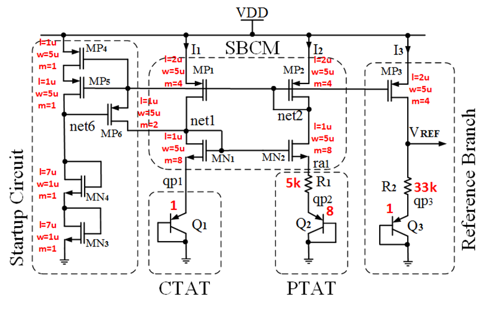
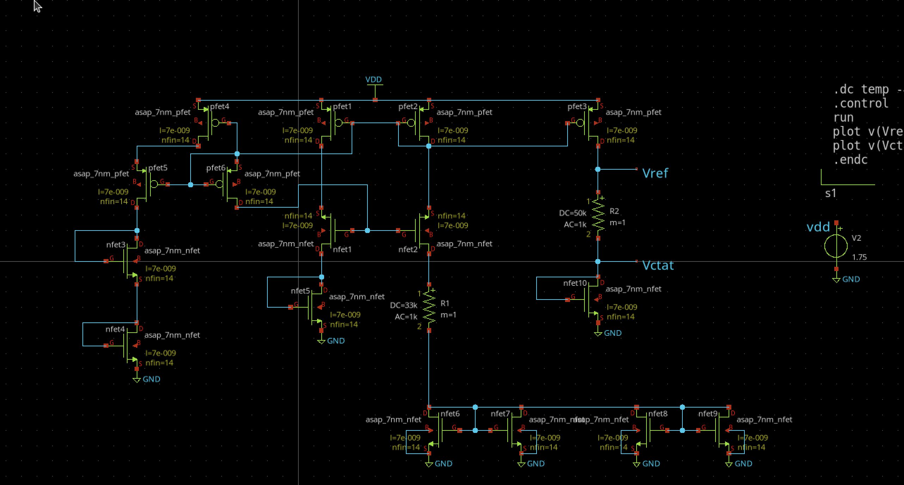
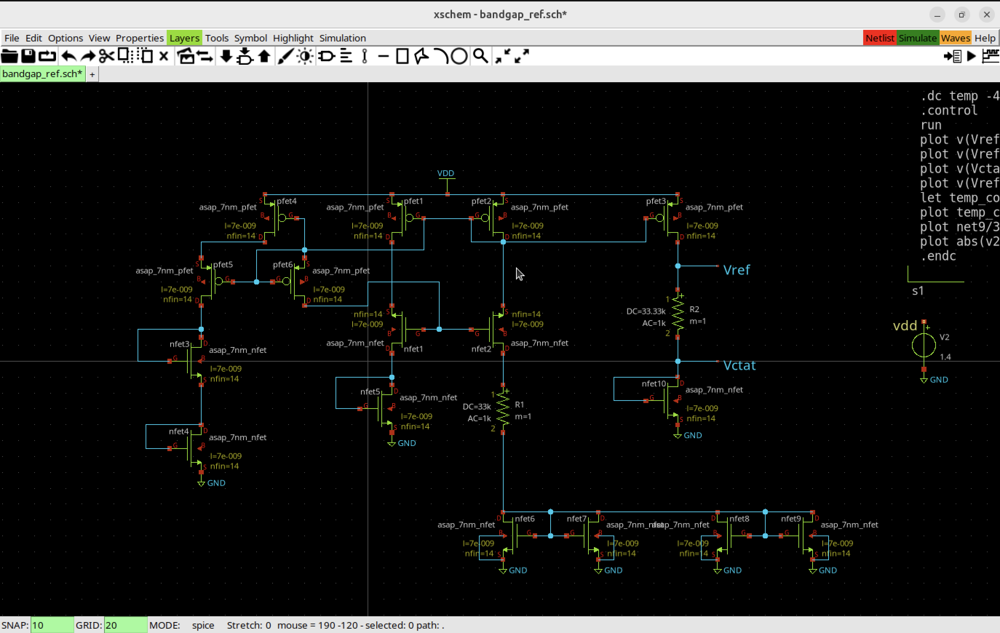
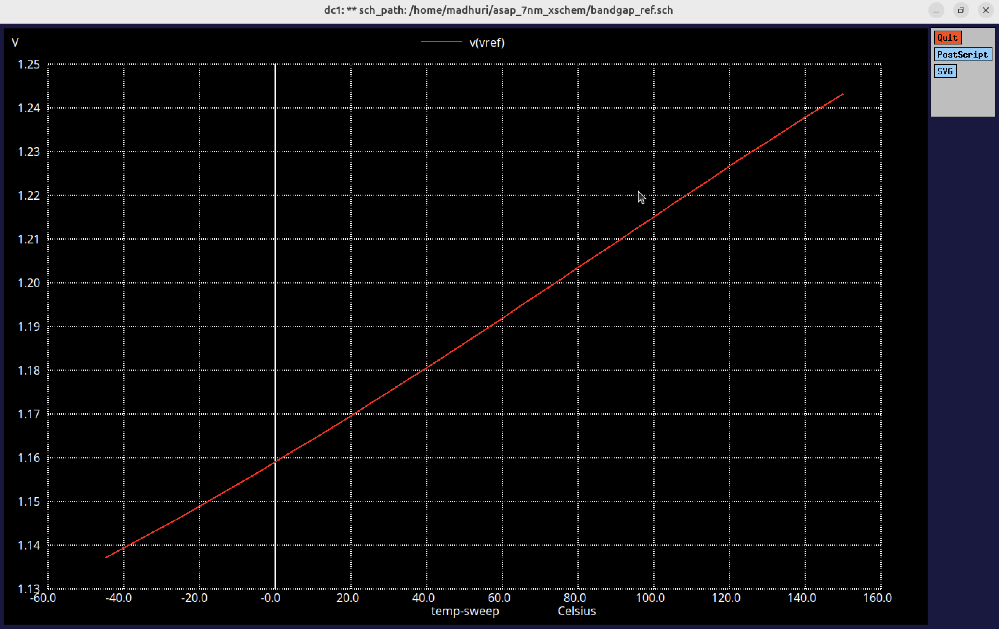
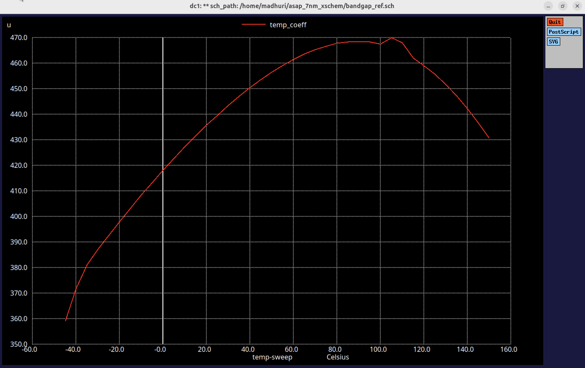

# Simulation and Characterization of SBCM bandgap reference circuit for ASAP 7nm PDK

## What is a bandgap Circuit? 

A bandgap reference circuit is an essential analog building block used to generate a stable and precise reference voltage that remains nearly constant across variations in temperature, supply voltage, and manufacturing process. It typically produces a voltage around 1.2V, which corresponds to the energy bandgap of silicon. The circuit achieves temperature independence by combining two voltage components—one that increases with temperature (PTAT: Proportional To Absolute Temperature) and one that decreases with temperature (CTAT: Complementary To Absolute Temperature)—in such a way that their temperature effects cancel each other out.

## Why do we need a bandgap circuit in 7nm Design? 

In advanced nodes like 7nm, where circuits operate at low supply voltages and are highly sensitive to fluctuations, the role of a bandgap reference becomes even more critical. It provides a reliable voltage baseline required for biasing analog components such as voltage regulators, analog-to-digital converters (ADCs), phase-locked loops (PLLs), and sensor interfaces within digital systems. Since 7nm designs also face increased PVT (Process, Voltage, Temperature) variation, a bandgap reference ensures system stability and performance by anchoring these analog subsystems with a consistent reference. 


## Tools Required for Simulization and characterization 

- Vitual Box (Ubuntu) for Windows or UTM (Ubuntu Image) for Mac OS
- Xschem - Spice Schematic Simulator for drawing and simulating circuits 
- Ngspice - Analog Circuit Simulator
- BSIM-CMG (Berkeley Short-channel IGFET Model for the Common Multi-Gate Structure), it is a compact model which helps in extending the characteristics of FinFets.
- ASAP 7nm PDK - Has all the circuits/FETs required for 7nm characterization

## Steps for Installation 

### Virtual Machine Installation 

For Windows users, download virtual box and install ubuntu. You can follow this link and install virtual box. [Virtual box Installation](https://www.youtube.com/watch?v=rJ9ysibH768&ab_channel=GEEKrar) 

For Mac, Install UTM and then load Ubuntu Image, This should launch ubuntu in your Mac. [Ubuntu through UTM](https://www.youtube.com/watch?v=MVLbb1aMk24&ab_channel=MoodyCodes)

### Installation of Xschem

Xschem is a schematic capture program, it allows creation of hierarchical representation of circuits with a top down approach . By focusing on interfaces, hierarchy and instance properties a complex system can be described in terms of simpler building blocks. A VHDL or Verilog or Spice netlist can be generated from the drawn schematic, allowing the simulation of the circuit. Key feature of the program is its drawing engine written in C and using directly the Xlib drawing primitives; this gives very good speed performance, even on very big circuits. The user interface is built with the Tcl-Tk toolkit, tcl is also the extension language used. [Xschem Repo](https://xschem.sourceforge.io/stefan/index.html) 

```
#install xschem a schemaic capture tool
git clone https://github.com/StefanSchippers/xschem.git xschem
cd xschem
./configure 
make 
sudo make install 
cd ..

```

### Installation of Ngspice 

Ngspice is an open-source circuit simulator based on SPICE (Simulation Program with Integrated Circuit Emphasis), widely used for simulating analog, digital, and mixed-signal electronic circuits. It allows designers to model circuit behavior using netlists or schematic capture tools like Xschem, and then perform various analyses such as transient, AC, DC, and noise simulations. Ngspice supports both standalone use and integration into EDA workflows, making it a powerful tool in open-source and academic IC design environments. Its compatibility with standard SPICE models and extensions for digital logic and behavioral modeling makes it versatile for both simple and complex circuit analysis. [Ngspice](https://ngspice.sourceforge.io/)

```
## clone the source repository into a local ngspice_git directory
git clone https://git.code.sf.net/p/ngspice/ngspice ngspice_git
cd ngspice_git
mkdir release
./autogen.sh
cd release
## by default if no --prefix is provided ngspice will install under /usr/local/{bin,share,man,lib}
## you can add a --prefix=/home/username to install into your home directory.
../configure --with-x --enable-xspice --disable-debug --enable-cider --with-readline=yes --enable-openmp --enable-osdi
## build the program
make
## install the program and needed files.
sudo make install

```

### ASAP 7nm PDK 

The ASAP7 PDK (Predictive Design Kit) is a 7nm (nanometer) process design kit developed for academic and research purposes, not for commercial fabrication. It was created by Arizona State University in collaboration with ARM Holdings to simulate advanced technology nodes and study design methodologies, tools, and architecture at 7nm without requiring access to proprietary foundry data. [ASAP 7nm PDK](https://asap.asu.edu/) 

There were two git repositories which I used for this experiment, you could clone either of them and install the PDK and related files. 

```
git clone https://github.com/AsahiroKenpachi/asap_7nm_Xschem.git

```

```

git clone https://github.com/The-OpenROAD-Project/asap7.git

``` 

### BSIM-CMG (Berkeley Short-channel IGFET Model for the Common Multi-Gate Structure)

The BSIM-CMG (Berkeley Short-channel IGFET Model – Common Multi-Gate) is a compact SPICE model developed by the BSIM Group at UC Berkeley specifically for multi-gate (MG) FETs, including FinFETs, Gate-All-Around (GAA) FETs, and other emerging multi-gate transistor architectures used in advanced technology nodes. [BSIM-CMG](https://bsim.berkeley.edu/models/bsimcmg/) 

- For Mac Users the BSIM-CMG model which is given in the website doesn't work, we need a specific osdi which is written in verilog A, so that 

## Step-by-Step Design Overview

### Schematic Creation

1. Define the Circuit Nodes: Key nodes were defined, including power supply (VDD), ground (GND), output reference voltage (Vref), and critical internal nodes.
2. Component Selection

NFets and Pfets : The ASAP 7nm process models for both PMOS (asap_7nm_pfet) and NMOS (asap_7nm_nfet) transistors. For the performance like BJTs, Nfets Drain and Gate were shorted. This was done for accurate results. 

3. Resistors: Standard resistors were placed to set biasing currents and establish gain for temperature compensation, the values were adjusted according to the PTAT and CTAT behaviour. R1 is 33k and R2 (Rref) is 50k

4. Power Supply Configuration : Configured a 1.4V power supply (VDD) as the main source for the circuit, ensuring all components received adequate voltage for proper operation.
Current Mirrors Implementation and implemented a current mirror using PMOS transistors to provide a stable current source for the circuit. This is critical for the accurate generation of both CTAT and PTAT voltages.
The current mirror consists of two PMOS transistors, with one configured as a reference and the other mirroring the current to the output stage.
5. CTAT and PTAT Voltage Generation

```CTAT Voltage:``` Created a pathway for generating a voltage that decreases with increasing temperature, resembling the PTAT behavior. This was achieved through the arrangement of NMOS transistors connected to a resistor that sets the appropriate voltage drop.
```PTAT Voltage:``` A separate branch of the circuit was designed to produce a voltage that is proportional to the absolute temperature. This was done using a different arrangement of NMOS transistors, ensuring that the output voltage changes linearly with temperature.

6. Output Voltage (Vref) Configuration
The final output voltage (Vref) was derived from the combination of CTAT and PTAT outputs. 

After completing the schematic,  the simulation parameters were set up within Xschem to run a DC analysis. The simulation was configured to sweep the temperature from -45°C to 125°C.


The below image is taken as a reference for designing a bandgap circuit using SBCM 

<picture>

</picture>


#### Design using Xschem 

<picture>

</picture>


## Bandgap Reference Circuit characteristics table 

This document summarizes the key parameters of the bandgap reference circuit used for temperature compensation and stable output voltage generation.

## Parameters

| Parameter         | Description                              | Min   | Type       | Max   | Unit | Condition                         |
|-------------------|------------------------------------------|-------|-----------|-------|------|-----------------------------------|
| **Vref**          | Output reference voltage                 | 1.12  | 1.19756   | 1.26  | V    | T = -45°C to 150°C, VDD = 1.4V   |
| **Vctat**         | Complementary to absolute temperature     | 140   | 190       | 210   | mV   | T = -45°C to 150°C, VDD = 1.4V   |
| **Vptat**         | Proportional to absolute temperature      | 0.93  | -         | 1.11  | V    | T = -45°C to 150°C, VDD = 1.4V   |
| **VDD**           | Supply Voltage                            | -     | 1.4       | -     | V    | T = -45°C to 150°C               |
| **IDD (EN=1)**    | Supply Current                           | -     | 35.20     | -     | µA   | VDD = 1.4V, T = 27°C             |
| **RL**            | Load Resistance                          | -     | 33.33     | -     | kΩ   | VDD = 1.4V, T = 27°C             |
| **R1**            | Resistance 1                             | -     | 33        | -     | kΩ   | VDD = 1.4V, T = 27°C             |
| **temp_coeff**    | Temperature Coefficient                  | 360  |    -       | 432   | ppm/°C| T = -45°C to 150°C, VDD = 1.4V | 

## Summary of Key Parameters

| **Parameter**             | **Value / Description**                             |
|---------------------------|-----------------------------------------------------|
| **Output Reference Voltage (Vref)** | 1.12 V to 1.26 V (over a wide temperature range)     |
| **CTAT Voltage (Vctat)**  | Provides temperature compensation                   |
| **PTAT Voltage (Vptat)**  | 0.93 V to 1.11 V                                     |
| **Supply Voltage (VDD)**  | Fixed at 1.4 V                                      |
| **Supply Current (IDD)**  | 35.20 µA at 27°C (when enabled)                     |
| **Load Resistance (RL)**  | 33.33 kΩ (affects output under load)                |
| **Resistor R1**           | 33 kΩ (associated with the PTAT branch)             |
| **Temperature Coefficient** | Used to evaluate voltage stability across temp   |


## Explanation 

This project demonstrates the design and operation of a Bandgap Reference (BGR) circuit using 7nm ASAP technology. The goal of the circuit is to generate a temperature-independent reference voltage by combining the properties of Proportional to Absolute Temperature (PTAT) and Complementary to Absolute Temperature (CTAT) voltages. Such circuits are crucial in integrated circuit design for creating a stable voltage reference, regardless of temperature, process variations, or supply fluctuations.

```
Key Components:
MOSFETs (pMOS and nMOS transistors)
Resistors
Self-Biasing Current Mirrors
Startup Circuit
Main Output:
Vref: The desired temperature-independent reference voltage.
Vctat: A voltage that is complementary to the absolute temperature, used in temperature compensation.
```

### Circuit Functionality 

#### SCMB - Self Current Mirror Based Confiuration 

The circuit employs self-biasing current mirrors using matched pMOS and nMOS transistors to maintain stable currents in different branches of the circuit. Current mirrors play a vital role in balancing the PTAT and CTAT components that determine the reference voltage.

Key Current Mirror Transistors:
- pfet1, pfet2, pfet3: These pMOS transistors form a current mirror network to maintain stable biasing throughout the circuit.
- nfet1, nfet2: These nMOS transistors mirror the current in the lower portion of the circuit, which contributes to generating the CTAT voltage.

#### Startup Circuit
A startup circuit is required to ensure that the bandgap reference starts up correctly and avoids falling into a non-operational state (zero-current state). Without this circuit, the bandgap could remain in an undesired state where no current flows, rendering the reference non-functional.

Startup Transistors: The bottom part of the circuit includes additional transistors, like nfet8 and pfet6, that help kick-start the current when power is first applied, ensuring the circuit reaches its stable operating point.

#### The Schematic Diagram 

<picture>

</picture>


#### PTAT Voltage Generation - Proportional to Absolute Temperature 

PTAT voltage is a crucial part of the temperature compensation mechanism in bandgap reference circuits. It is generated by creating a current that increases proportionally with temperature.

Resistor Network: The resistors R1 and R2 in the circuit, along with the associated transistors, are used to generate the PTAT current.
nMOS Transistors: The nfet1, nfet2 transistors create a current that depends on the temperature-dependent voltage drop across the resistors. This forms the PTAT component.

The PTAT current increases as temperature increases, helping to counteract the CTAT component and maintain a stable reference voltage.

Ngpsice command 

```
plot v(vref) -v(Vctat)

```

#### The PTAT voltage Graph 

<picture>

</picture>


#### CTAT Voltage generation - Complementary to Absolute Temperature 

This voltage decreases with an increase in temperature, and it is crucial for creating the temperature compensation effect.

Vctat Node: The voltage at the Vctat node decreases with temperature, exhibiting CTAT behavior. This voltage is generated by the lower half of the circuit, which includes nMOS transistors and their associated current mirrors.

Ngspice command 

```
plot v(Vctat)

```

#### The CTAT Voltage Graph 

<picture>

</picture>


#### Temperature Compensation and Voltage Reference (Vref)

The core functionality of the bandgap reference lies in summing the PTAT and CTAT voltages in a specific ratio that cancels out their temperature dependencies. This produces a stable reference voltage (Vref) at the desired node. The circuit is designed to maintain a constant output regardless of temperature variations.

Vref Node: The Vref node in the circuit provides the temperature-stable reference voltage, a sum of the PTAT and CTAT voltages. This reference voltage can be used in various applications, such as ADCs, voltage regulators, and other analog circuits.

Ngspice command 

```
plot v(Vref)

``` 

#### The Reference Voltage 

<picture>

</picture>


### Temperature Coefficient

The temperature coefficient (TC) of a reference voltage is a measure of how much the output voltage changes with temperature. In the context of bandgap reference (BGR) circuits, the goal is to create a voltage that remains as stable as possible across a wide temperature range. The TC tells us how sensitive the reference voltage is to temperature variations.

The temperature coefficient is expressed as the change in the reference voltage per degree Celsius (or Kelvin) relative to the nominal voltage at a specific temperature (typically room temperature).

It is usually expressed in ppm/°C (parts per million per degree Celsius) or mV/°C.

Formula 
```
TC = [(Vref(T2) - Vref(T1)) / ((T2 - T1) * Vref(T1))] * 10^6 ppm/°C
```
ngspice command to get temperature coefficient 

```
plot deriv(v(Vref))/1.20 - I have just taken the nominal voltage and plot it across the temp sweep. For accurate value, I have done manual claculation.

```

Where:
- V_ref(T1) is the reference voltage at temperature T1 (usually at room temperature at -45°C).
- V_ref(T2) is the reference voltage at temperature T2 (temperature at 150°C).
- (T2 - T1) is the temperature difference in °C.
- 10^6 converts the result to parts per million (ppm).


<picture>

</picture>

### Formulas to calculate the parameters 


I have calculated the parameters from the graphs that were plotted, but to get the parameters we can always refer to the formulas. 


1. **PTAT Current Calculation**  
   The Proportional to Absolute Temperature (PTAT) current \(I_{PTAT}\) is given by:

   $$
   I_{PTAT} = \frac{V_T \cdot \ln(N)}{R_1}
   $$

   Where:
   - \(V_T = \frac{kT}{q}\) (Thermal Voltage)
   - \(k\) = Boltzmann's constant (1.38 × 10<sup>-23</sup> J/K)
   - \(T\) = Absolute temperature in Kelvin
   - \(q\) = Charge of an electron (1.6 × 10<sup>-19</sup> C)
   - \(N\) = Emitter area ratio of matched transistors
   - \(R_1\) = Resistor value used in the PTAT generation branch

2. **CTAT Voltage Calculation**
The Complementary to Absolute Temperature (CTAT) voltage \(V_{CTAT}\) is given by:

**V<sub>CTAT</sub> = V<sub>BE0</sub> - βT**

Where:
- **V<sub>BE0</sub>** = Base-emitter voltage at absolute zero temperature
- **β** = Temperature coefficient of \(V_{BE}\) (typically -2 mV/K)
- **T** = Temperature in Kelvin

3. **Reference Voltage Calculation (V<sub>ref</sub>)**

The reference voltage is given by:


**V<sub>ref</sub> = V<sub>CTAT</sub> + k · V<sub>PTAT</sub>**


Where:
- **k = R<sub>2</sub> / R<sub>1</sub>** (Scaling factor determined by the resistor ratio)


4. **Resistor Values**

The resistor values \(R_1\) and \(R_2\) are given by:


**R<sub>2</sub> = k · R<sub>1</sub>**


5. **Startup Circuit Currents**

The startup current \(I_{startup}\) can be calculated by:

**I<sub>startup</sub> ≈ (V<sub>gs</sub> - V<sub>th</sub>) / R<sub>startup</sub>**


Where:
- **V<sub>gs</sub>** = Gate-source voltage of the startup transistor
- **V<sub>th</sub>** = Threshold voltage of the nMOS transistor
- **R<sub>startup</sub>** = Resistance in the startup circuit path


6. **Current Mirror Relationships**


The output current \(I_{out}\) is given by:


**I<sub>out</sub> = (W/L)<sub>out</sub> · (W/L)<sub>ref</sub> · I<sub>ref</sub>**

Where:
- **I<sub>ref</sub>** = Reference current set by the current mirror


## The SPICE FILE (sch) 

```

** sch_path: /home/madhuri/asap_7nm_Xschem/bandgap_ref.sch
**.subckt bandgap_ref
Xnfet1 net7 net1 net3 net10 asap_7nm_nfet l=7e-009 nfin=14
Xnfet2 net9 net1 net2 net11 asap_7nm_nfet l=7e-009 nfin=14
Xpfet1 net3 net2 VDD net12 asap_7nm_pfet l=7e-009 nfin=14
Xpfet2 net2 net2 VDD net13 asap_7nm_pfet l=7e-009 nfin=14
Xpfet3 Vref net2 VDD net14 asap_7nm_pfet l=7e-009 nfin=14
Xpfet4 net4 net2 VDD net15 asap_7nm_pfet l=7e-009 nfin=14
Xpfet5 net5 net2 net4 net16 asap_7nm_pfet l=7e-009 nfin=14
Xpfet6 net1 net2 net2 net17 asap_7nm_pfet l=7e-009 nfin=14
Xnfet3 net5 net5 net6 net18 asap_7nm_nfet l=7e-009 nfin=14
Xnfet4 net6 net6 GND net19 asap_7nm_nfet l=7e-009 nfin=14
Xnfet5 net7 net7 GND net20 asap_7nm_nfet l=7e-009 nfin=14
Xnfet6 net8 net8 GND GND asap_7nm_nfet l=7e-009 nfin=14
Xnfet7 net8 net8 GND GND asap_7nm_nfet l=7e-009 nfin=14
Xnfet8 net8 net8 GND GND asap_7nm_nfet l=7e-009 nfin=14
Xnfet9 net8 net8 GND GND asap_7nm_nfet l=7e-009 nfin=14
R1 net9 net8 33k ac=1k m=1
R2 Vref Vctat 33.33k ac=1k m=1
Xnfet10 Vctat Vctat GND net21 asap_7nm_nfet l=7e-009 nfin=14
V2 vdd GND 1.4
**** begin user architecture code


.dc temp -45 150 5
.control
run
plot v(Vref) v(Vctat)
plot v(Vref)-v(Vctat)
plot v(Vctat)
plot v(Vref)
let temp_coeff = deriv(v(Vref))/1.24
plot temp_coeff
plot net9/30k Vref/33.33k vctat/33.33k
plot abs(v2#branch)
.endc


**** end user architecture code
**.ends
.GLOBAL GND
.GLOBAL VDD
**** begin user architecture code

.subckt asap_7nm_pfet S G D B l=7e-009 nfin=14
	npmos_finfet S G D B BSIMCMG_osdi_P l=7e-009 nfin=14
.ends asap_7nm_pfet

.model BSIMCMG_osdi_P BSIMCMG_va (
+ TYPE = 0

************************************************************
*                         general                          *
************************************************************
+version = 107             bulkmod = 1               igcmod  = 1               igbmod  = 0
+gidlmod = 1               iimod   = 0               geomod  = 1               rdsmod  = 0
+rgatemod= 0               rgeomod = 0               shmod   = 0               nqsmod  = 0
+coremod = 0               cgeomod = 0               capmod  = 0               tnom    = 25
+eot     = 1e-009          eotbox  = 1.4e-007        eotacc  = 3e-010          tfin    = 6.5e-009
+toxp    = 2.1e-009        nbody   = 1e+022          phig    = 4.9278          epsrox  = 3.9
+epsrsub = 11.9            easub   = 4.05            ni0sub  = 1.1e+016        bg0sub  = 1.17
+nc0sub  = 2.86e+025       nsd     = 2e+026          ngate   = 0               nseg    = 5
+l       = 2.1e-008        xl      = 1e-009          lint    = -2.5e-009       dlc     = 0
+dlbin   = 0               hfin    = 3.2e-008        deltaw  = 0               deltawcv= 0
+sdterm  = 0               epsrsp  = 3.9             nfin    = 1
+toxg    = 1.8e-009
************************************************************
*                            dc                            *
************************************************************
+cit     = 0               cdsc    = 0.003469        cdscd   = 0.001486        dvt0    = 0.05
+dvt1    = 0.36            phin    = 0.05            eta0    = 0.094           dsub    = 0.24
+k1rsce  = 0               lpe0    = 0               dvtshift= 0               qmfactor= 0
+etaqm   = 0.54            qm0     = 2.183e-012      pqm     = 0.66            u0      = 0.0237
+etamob  = 4               up      = 0               ua      = 1.133           eu      = 0.05
+ud      = 0.0105          ucs     = 0.2672          rdswmin = 0               rdsw    = 200
+wr      = 1               rswmin  = 0               rdwmin  = 0               rshs    = 0
+rshd    = 0               vsat    = 60000           deltavsat= 0.17            ksativ  = 1.592
+mexp    = 2.491           ptwg    = 25              pclm    = 0.01            pclmg   = 1
+pdibl1  = 800             pdibl2  = 0.005704        drout   = 4.97            pvag    = 200
+fpitch  = 2.7e-008        rth0    = 0.15            cth0    = 1.243e-006      wth0    = 2.6e-007
+lcdscd  = 0               lcdscdr = 0               lrdsw   = 1.3             lvsat   = 1441
************************************************************
*                         leakage                          *
************************************************************
+aigc    = 0.007           bigc    = 0.0015          cigc    = 1               dlcigs  = 5e-009
+dlcigd  = 5e-009          aigs    = 0.006           aigd    = 0.006           bigs    = 0.001944
+bigd    = 0.001944        cigs    = 1               cigd    = 1               poxedge = 1.152
+agidl   = 2e-012          agisl   = 2e-012          bgidl   = 1.5e+008        bgisl   = 1.5e+008
+egidl   = 1.142           egisl   = 1.142
************************************************************
*                            rf                            *
************************************************************
************************************************************
*                         junction                         *
************************************************************
************************************************************
*                       capacitance                        *
************************************************************
+cfs     = 0               cfd     = 0               cgso    = 1.6e-010        cgdo    = 1.6e-010
+cgsl    = 0               cgdl    = 0               ckappas = 0.6             ckappad = 0.6
+cgbo    = 0               cgbl    = 0
************************************************************
*                       temperature                        *
************************************************************
+tbgasub = 0.000473        tbgbsub = 636             kt1     = 0               kt1l    = 0
+ute     = -1.2            utl     = 0               ua1     = 0.001032        ud1     = 0
+ucste   = -0.004775       at      = 0.001           ptwgt   = 0.004           tmexp   = 0
+prt     = 0               tgidl   = -0.007          igt     = 2.5
************************************************************
*                          noise                           *
************************************************************
**)
.control
pre_osdi /home/madhuri/asap_7nm_Xschem/bsimcmg_arch64.osdi
.endc


.subckt asap_7nm_nfet S G D B l=7e-009 nfin=14
	nnmos_finfet S G D B BSIMCMG_osdi_N l=7e-009 nfin=14
.ends asap_7nm_nfet

.model BSIMCMG_osdi_N BSIMCMG_va (
+ TYPE = 1
************************************************************
*                         general                          *
************************************************************
+version = 107             bulkmod = 1               igcmod  = 1               igbmod  = 0
+gidlmod = 1               iimod   = 0               geomod  = 1               rdsmod  = 0
+rgatemod= 0               rgeomod = 0               shmod   = 0               nqsmod  = 0
+coremod = 0               cgeomod = 0               capmod  = 0               tnom    = 25
+eot     = 1e-009          eotbox  = 1.4e-007        eotacc  = 1e-010          tfin    = 6.5e-009
+toxp    = 2.1e-009        nbody   = 1e+022          phig    = 4.2466          epsrox  = 3.9
+epsrsub = 11.9            easub   = 4.05            ni0sub  = 1.1e+016        bg0sub  = 1.17
+nc0sub  = 2.86e+025       nsd     = 2e+026          ngate   = 0               nseg    = 5
+l       = 2.1e-008        xl      = 1e-009          lint    = -2e-009         dlc     = 0
+dlbin   = 0               hfin    = 3.2e-008        deltaw  = 0               deltawcv= 0
+sdterm  = 0               epsrsp  = 3.9             nfin    = 1
+toxg    = 1.80e-009
************************************************************
*                            dc                            *
************************************************************
+cit     = 0               cdsc    = 0.01            cdscd   = 0.01            dvt0    = 0.05
+dvt1    = 0.47            phin    = 0.05            eta0    = 0.07            dsub    = 0.35
+k1rsce  = 0               lpe0    = 0               dvtshift= 0               qmfactor= 2.5
+etaqm   = 0.54            qm0     = 0.001           pqm     = 0.66            u0      = 0.0303
+etamob  = 2               up      = 0               ua      = 0.55            eu      = 1.2
+ud      = 0               ucs     = 1               rdswmin = 0               rdsw    = 200
+wr      = 1               rswmin  = 0               rdwmin  = 0               rshs    = 0
+rshd    = 0               vsat    = 70000           deltavsat= 0.2             ksativ  = 2
+mexp    = 4               ptwg    = 30              pclm    = 0.05            pclmg   = 0
+pdibl1  = 0               pdibl2  = 0.002           drout   = 1               pvag    = 0
+fpitch  = 2.7e-008        rth0    = 0.225           cth0    = 1.243e-006      wth0    = 2.6e-007
+lcdscd  = 5e-005          lcdscdr = 5e-005          lrdsw   = 0.2             lvsat   = 0
************************************************************
*                         leakage                          *
************************************************************
+aigc    = 0.014           bigc    = 0.005           cigc    = 0.25            dlcigs  = 1e-009
+dlcigd  = 1e-009          aigs    = 0.0115          aigd    = 0.0115          bigs    = 0.00332
+bigd    = 0.00332         cigs    = 0.35            cigd    = 0.35            poxedge = 1.1
+agidl   = 1e-012          agisl   = 1e-012          bgidl   = 10000000        bgisl   = 10000000
+egidl   = 0.35            egisl   = 0.35
************************************************************
*                            rf                            *
************************************************************
************************************************************
*                         junction                         *
************************************************************
************************************************************
*                       capacitance                        *
************************************************************
+cfs     = 0               cfd     = 0               cgso    = 1.6e-010        cgdo    = 1.6e-010
+cgsl    = 0               cgdl    = 0               ckappas = 0.6             ckappad = 0.6
+cgbo    = 0               cgbl    = 0
************************************************************
*                       temperature                        *
************************************************************
+tbgasub = 0.000473        tbgbsub = 636             kt1     = 0               kt1l    = 0
+ute     = -0.7            utl     = 0               ua1     = 0.001032        ud1     = 0
+ucste   = -0.004775       at      = 0.001           ptwgt   = 0.004           tmexp   = 0
+prt     = 0               tgidl   = -0.007          igt     = 2.5
************************************************************
*                          noise                           *
************************************************************
**)
.control
pre_osdi /home/madhuri/asap_7nm_Xschem/bsimcmg_arch64.osdi
.endc


**** end user architecture code
.end


``` 

## Acknolwdgements

I would like to thank Kunal Ghosh (Co-Founder of VSD), Dr Skandha Deepsita (Senior Physical Design Engineer) and Jossan Eden (Electronics Engineer) for guiding me throughout this research work on Bandgap reference circuit using ASAP 7nm PDK. 

- Kunal Ghosh [linkedin](https://www.linkedin.com/in/kunal-ghosh-vlsisystemdesign-com-28084836/) 
- Dr. Skandha Deepsita [Linkedin](https://www.linkedin.com/in/dr-skandha-deepsita-s-027433ba?utm_source=share&utm_campaign=share_via&utm_content=profile&utm_medium=ios_app)
- Jossan Eden [Linkedin](https://www.linkedin.com/in/jossan-eleazar-b-79809a25a/) 

  ## References
- Github [vsdopen2021_bgr](https://github.com/vsdip/vsdopen2021_bgr/tree/main)
- Github [7nm Reference Repo](https://github.com/AsahiroKenpachi/asap_7nm_Xschem)
- 7nm Research paper [hal science research paper](https://hal.science/hal-01558775/document)\
- Ngspice Manual [Manual](https://ngspice.sourceforge.io/docs/ngspice-manual.pdf)
- Github [Bandgap Github](https://github.com/johnkustin/bandgapReferenceCircuit)
- Github[RSMadhuri](https://github.com/RSMadhuri66/Bandgap-Reference-Circuit-with-SCMB-with-ASAP-7nm-PDK-/blob/main/README.md)
- Github [sky130circuitdesign](https://github.com/VrushabhDamle/sky130CircuitDesignWorkshop?tab=readme-ov-file)
- Research paper [Layout and chractertization](https://mpedram.com/Papers/PowerDensity_7nm_FinFET-glsvsli15.pdf)
- Uc Berkeley research [Finfets](https://escholarship.org/content/qt2d46r42j/qt2d46r42j.pdf?t=q6z2kq)
- IIT labs [Finfet's research](https://vlsi-iitg.vlabs.ac.in/CMOS_theory.html#:~:text=Inverter%20Static%20Characteristics%20(VTC),logic%2Dlevels%20can%20be%20obtained)
- Michigan university classes [Parameters claculation](https://www.egr.msu.edu/classes/ece410/mason/files/Ch7.pdf)
- Cornell university ECE5745 [Capacitance and parameters](https://cornell-ece5745.github.io/ece5745-tut10-spice/)
- Ngspice tutorial [Tcl/Tk](https://ngspice.sourceforge.io/ngspice-control-language-tutorial.html)


